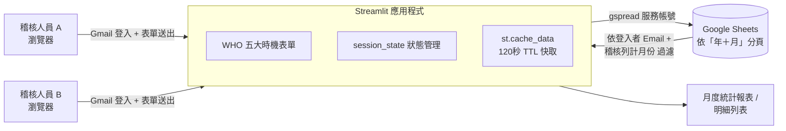

# 手部衛生稽核系統實務：一個以 AI 輔助程式開發（Vibe Coding）打造之雲端稽核工具的應用與開發歷程剖析

**作者：[請填入姓名]**
**服務單位：[請填入單位名稱]**
**聯絡方式：[請填入 Email]**

---

## 摘要

手部衛生遵從率是感染管制品質的核心指標，多數院所仍仰賴紙本稽核表進行「WHO 五大時機」的直接觀察紀錄，事後再由人工彙整、輸入電腦，過程耗時且不利多位稽核人員同步作業。本文報告一套以 **Streamlit** 為前端、**Google Sheets（透過 gspread 服務帳號）** 為後端的雲端手部衛生稽核系統之設計、實作與正式運作經驗。該系統支援 Gmail 登入、WHO 五大時機結構化表單、依「稽核列計月份」自動分頁儲存、依乾洗手／濕洗手動態顯示不正確原因的複選項目、歷史紀錄自動回填、以及依月份分組的稽核統計報表。

不同於傳統委外開發或全職工程團隊建置的方式，本系統是由不具全職軟體工程背景的稽核業務人員，透過 AI 程式碼生成工具以自然語言持續提示、迭代修正的方式獨力完成，過程與近期「Vibe Coding」文獻所描述的實務模式高度吻合 [5]。我們回顧橫跨約 6 個月、共 49 次提交（commit）的完整開發歷程，發現開發速度確實極快（多次単日內完成兩位數的功能迭代與修正），但也出現時區錯誤、變數未定義、欄位命名不一致、乃至需要「回復到前一版本」等典型的「先求能動、後補品質」現象，與 Fawzy 等人 [5] 提出的「速度—品質權衡矛盾」高度呼應。同時，本案例也顯示：透過保留模擬資料測試腳本、正式資料與測試資料分離、以及以 git 提交紀錄留下可追溯的修正軌跡，非專業開發者仍可在 AI 輔助下，為法規遵循／品質稽核用途建置出可長期穩定運作的工具。本文最後針對醫療照護場域中，由非專業開發者以 vibe coding 方式建置稽核／品質工具的實務，提出具體建議。

**關鍵詞：** 手部衛生稽核、WHO 五大時機、雲端資料收集、Streamlit、Vibe Coding、AI 輔助程式開發、感染管制資訊系統

---

## 1 前言

手部衛生（hand hygiene）是預防醫療照護相關感染最具成本效益的介入措施之一，世界衛生組織（WHO）提出的「手部衛生五大時機」（接觸病人前、執行清潔／無菌操作技術前、暴露病人體液風險後、接觸病人後、接觸病人周遭環境後）已成為全球醫療機構稽核手部衛生遵從率的共通架構 [1, 2]。然而，多數第一線稽核作業仍以紙本表單搭配事後人工登打的方式進行：稽核人員在病房內以紙筆逐項勾選觀察結果，稽核月底再由專責人員彙整成 Excel 報表。這種流程存在幾個實務痛點：（1）多位稽核人員的紀錄難以即時彙總；（2）跨科別、跨月份的統計需要大量人工整理；（3）紙本表單遺失或字跡辨識問題會直接影響資料品質；（4）稽核人員若分散於不同院區或班別，紙本傳遞造成延遲。

近年來，AI 程式碼生成工具（如 GitHub Copilot、ChatGPT、Claude 等）的普及，讓不具備專業軟體工程背景的使用者，也能以自然語言描述需求、迭代生成可執行的應用程式，這種依賴直覺與反覆嘗試、而非深入理解底層程式碼的開發方式，近期被稱為「Vibe Coding」[6]。Fawzy 等人 [5] 針對 101 份實務灰色文獻進行系統性回顧後指出，vibe coding 使用者普遍以「速度」與「可及性」為主要動機，並經常體驗到「立即成功的心流」，但同時也承認產出的程式碼「快但有缺陷」，且品質保證（QA）作業經常被省略、被過度信任，或整個委由 AI 自行檢查。

本文報告的手部衛生稽核系統，正是在真實醫療／長照場域中，由稽核業務相關人員以 AI 輔助、vibe coding 式的迭代提示方式獨立完成的一個實例。與 Fawzy 等人 [5] 以第三方文獻回顧、擷取他人自述行為單元的研究方法不同，本文採取**第一手、單一案例、完整開發歷程回顧**的方式：我們檢視了該系統自初始提交至今，橫跨約 6 個月、共 49 次 git 提交的完整變更紀錄，逐一分析每次迭代所解決的問題、所反映的開發模式，並將觀察結果對照 vibe coding 文獻中歸納的主題（如「速度與效率」動機、「重新提示而非除錯」的 QA 行為、「程式碼中斷或回復」的經驗等），檢視這些在灰色文獻中被歸納出的通用行為模式，是否，以及如何，具體出現在一個攸關醫療品質稽核、必須長期穩定運作的正式系統之中。

本文的貢獻有三：

1. 描述一套實際運作中的雲端手部衛生稽核系統之需求、架構與關鍵設計決策（第 3 節）；
2. 以完整的版本控制紀錄為依據，重建並分析該系統約 6 個月的 AI 輔助開發歷程，作為 vibe coding 在醫療品質稽核領域的第一手縱向案例（第 3.6、4 節）；
3. 對照既有 vibe coding 文獻的發現，討論在「稽核資料攸關法規遵循與病人安全」此一高風險情境下，非專業開發者以 AI 輔助建置工具時，應如何取捨速度與品質、應採取哪些具體的品質保證作法（第 5 節）。

## 2 相關文獻

**手部衛生稽核方法學。** 直接觀察法（direct observation）長期被視為稽核手部衛生遵從率的「金標準」，WHO 的五大時機架構即是為此設計 [1]，但其亦存在觀察者效應（Hawthorne effect）與人力成本高的限制——即受稽核者知悉正被觀察時會暫時提高遵從表現，導致直接觀察所得的遵從率可能被高估 [3]；為此，部分院所導入電子式監測系統（如感應式警示裝置、影像辨識）以降低人力負擔並減少觀察者效應偏誤 [4]，但建置成本與導入複雜度往往超出中小型院所或長照機構的能力範圍。本文所述系統採取的策略，是保留直接觀察法的專業判斷（由受過訓練的稽核人員現場評估時機與技術正確性），但以低成本的雲端表單取代紙本紀錄與人工彙整，藉此在不改變稽核方法學的前提下，解決資料蒐集與彙整的效率問題。

**AI 輔助程式開發與 Vibe Coding。** Karpathy [6] 於 2025 年提出「vibe coding」一詞，描述使用者以自然語言描述期望結果、透過 AI 程式碼生成工具反覆提示，而非深入理解生成程式碼的開發方式。Fawzy 等人 [5] 對 101 份實務灰色文獻進行系統性回顧，萃取 518 個行為單元，發現 vibe coder 的主要動機依序為速度與效率（62%）、可及性與賦權（14%）、學習與實驗（11%）；最常見的體驗是「立即成功的心流」（64%）；對程式碼品質最常見的認知是「快但有缺陷」（68%）；而品質保證作法中，最常見的則是「略過 QA」（36%），其次是「人工測試或修改」（29%）與「不加批判的信任」（18%）。該研究同時指出，vibe coding 正在造就一群「能建置產品、卻無法在出錯時自行除錯」的新型脆弱開發者。

這樣的現象也呼應資訊系統領域對「公民開發者」（citizen developer）與低程式碼（low-code）平台的既有討論：研究指出，讓不具備正式軟體工程背景的使用者利用低程式碼平台快速開發應用程式，雖能提升組織效率，卻也可能因缺乏治理而產生軟體品質不佳、陰影 IT（shadow IT）與技術債等風險，在醫療等高度受規範產業中尤其需要謹慎 [7]。Vibe coding 與公民開發雖然使用的工具不同（前者以自然語言驅動 AI 生成程式碼，後者以視覺化拖拉元件為主），但兩者共享同一核心風險：開發速度與可及性的提升，往往伴隨對底層邏輯理解程度的下降。

既有 vibe coding 研究多以橫斷面、第三方彙整他人自述的方式取樣，較少針對**單一、攸關法規遵循的正式系統**，追蹤其完整版本歷程。本文即嘗試補上這一塊：以真實的 git 提交紀錄作為行為證據，而非受訪者的事後回憶或部落格自述，檢視 vibe coding 文獻歸納的主題在一個具體、長期運作系統中的呈現方式。

## 3 系統設計與開發方法

### 3.1 開發脈絡

本系統的開發者並非全職軟體工程師，而是熟悉手部衛生稽核業務、但不具備正式程式設計訓練的稽核相關人員。整套系統是透過 AI 程式碼生成工具，以自然語言描述需求（例如「新增受稽核人員類別：外籍照服員」「修正時區問題：使用台灣時區記錄稽核時間」），並由 AI 生成或修改對應程式碼、經人工在瀏覽器中實際測試後迭代確認的方式完成，符合 Fawzy 等人 [5] 對 vibe coding 的定義：以自然語言描述目標、迭代提示、僅進行最低限度的程式碼審閱。

### 3.2 需求與設計目標

系統的核心需求包括：

- **多人同時填寫**：不同班別、不同單位的稽核人員可在各自的裝置上同時填寫，不需共用同一份檔案；
- **免自建伺服器與資料庫**：以最低的建置與維運成本，達成資料的雲端集中儲存；
- **結構化的 WHO 五大時機紀錄**：避免紙本自由填寫造成的欄位不一致；
- **依乾洗手／濕洗手動態呈現不正確原因**：因兩種手部衛生方式的常見錯誤型態不同，需分開設計選項；
- **月度統計與明細報表**：提供稽核人員與感控單位隨時查看當月／前一月的稽核次數、人員類別分布與明細列表。

### 3.3 系統架構

系統採取三層式架構：Streamlit 提供瀏覽器端的表單介面與狀態管理（`st.session_state`）[9]；`gspread` 服務帳號作為後端資料存取層 [10]；Google Sheets 則作為零維運成本的多人共享資料庫 [11]，並以「年＋月」（例如「2026年7月」）作為工作表（worksheet）的分頁單位。

**表 1：系統核心功能與對應設計決策**

| 功能模組 | 說明 |
|---|---|
| Gmail 登入 | 以文字輸入 Email 作為輕量級的使用者識別，用於歷史紀錄回填與資料歸戶（非正式 OAuth 驗證，見第 5.4 節限制討論） |
| WHO 五大時機表單 | 單選五大時機、單選手部衛生方式（乾洗手／濕洗手／沒有洗手） |
| 動態不正確原因複選 | 依乾洗手或濕洗手顯示不同的不正確原因選項（如乾洗手著重搓揉時間，濕洗手著重是否擦乾），並支援複選與「其他」自由輸入 |
| 稽核列計月份邏輯 | 每月 5 日前可檢視前一個月的稽核結果，6 日起僅顯示當月，避免月份混淆 |
| 依月份自動分頁 | 依「稽核列計月份」而非系統送出時間寫入對應年月工作表，確保紀錄歸入正確月份 |
| 歷史紀錄回填 | 載入登入者當月（含寬限期內前一月）最新一筆紀錄，自動帶入單位、姓名、人員類別等重複性欄位 |
| 快取與配額管理 | 以 `st.cache_data`（TTL 120 秒）搭配 `cache_buster` 版本號，降低對 Google Sheets API 的重複查詢頻率 |
| 月度統計報表 | 依「稽核列計月份」分組，顯示各月總稽核次數、各受稽核人員類別次數，並提供可捲動的明細表格 |

### 3.4 資料模型

每筆觀察紀錄包含以下欄位：登入者 Email、稽核日期／時間（台灣時區 UTC+8）、稽核列計月份、稽核者單位、稽核人員、受稽核人員類別、受稽核者單位、手部衛生時機（WHO 五大時機之一）、手部衛生方式（乾洗手／濕洗手／沒有洗手）、手部衛生正確性（正確／不正確／未評估）、不正確原因（複選，以逗號合併儲存）、備註。此設計讓單一工作表即可同時支撐「遵從率計算」（是否執行手部衛生、是否正確）與「不正確原因的類型分析」兩種後續分析需求。

### 3.5 關鍵工程決策與其修正歷程

以下三項設計，是整個開發過程中反覆修正次數最多的部分，也最能呈現 vibe coding 式開發在正式系統中的樣貌：

**(1) 月份判定與前一月檢視邏輯。** 最初版本僅以稽核月份下拉選單記錄使用者「選擇」的月份，但很快發現使用者所選的稽核列計月份與系統實際送出時間可能不一致，若僅以送出時間分頁，會導致統計月份歸屬不準確。系統因此新增「稽核列計月份」欄位取代原本語意模糊的「稽核月份」，並訂出「每月 5 日前可檢視前一個月的稽核結果，6 日起僅顯示當月」的規則，這個規則本身即經過至少 3 次提交的來回修正才穩定下來。

**(2) 歷史紀錄載入與快取。** 早期版本每次都重新查詢 Google Sheets 以取得使用者歷史紀錄，多人同時使用時很快便觸發 API 配額限制，甚至一度造成「紀錄消失」的假象（配額超限但未妥善提示錯誤）。此問題在 2026 年 7 月的密集修正期間，透過導入 `st.cache_data` 的 120 秒 TTL 快取、以及僅在使用者本人送出資料時才主動刷新快取版本號（`cache_buster`）的方式解決，同時盡量將多次獨立的 API 呼叫合併為一次 `worksheets()` 呼叫後於本機端比對，避免對 Google Sheets 重複發送中繼資料查詢。

**(3) 版面配置的多輪迭代。** 表單版面在 2026 年 7 月 2 日單日內歷經至少 8 次版面調整（見表 2），從單欄改為左右並排卡片、再從三欄合併為二欄、調整核取方塊間距與字級，顯示 UI 微調在 vibe coding 流程中往往需要多輪「所見即所得」的來回確認，而非一次到位。

### 3.6 開發歷程總覽

我們以 `git log` 完整重建開發時間軸，系統自 2026 年 1 月 10 日首次提交至 2026 年 7 月 2 日最新一批提交，共計 **49 次提交**，可分為五個階段：

**表 2：開發階段與提交分布（依日期彙總，共 49 次提交）**

| 階段 | 日期 | 提交數 | 主要內容 |
|---|---|---|---|
| 第一階段：初版建置 | 2026-01-10 | 8 | 建立 Streamlit 表單雛型、串接 Google Sheets、修正「沒有洗手」選擇邏輯、依乾洗手／濕洗手區分不正確原因、依月份自動分頁 |
| 第二階段：欄位微調 | 2026-01-11～01-13 | 4 | 更正單位名稱錯字、不正確原因改為複選核取方塊、調整選項文字用詞 |
| 第三階段：規則修正 | 2026-02-26 | 4 | 新增「感管中心」單位選項、修正稽核列計月份選擇邏輯、修正 `audit_month` 未定義錯誤、修正時區問題 |
| 第四階段：歷史紀錄功能 | 2026-04-02 | 11 | 新增月度歷史紀錄回填功能、修正欄位命名（稽核月份→稽核列計月份）、依稽核列計月份而非送出時間歸戶、重構月度統計報表 |
| 第五階段：顯示規則與 UI／效能重構 | 2026-04-09、2026-07-02 | 3 + 19 | 調整同使用者月度顯示規則、大量降低 Google Sheets API 呼叫、含 2 次「回復到前一版本」的還原提交、8 次版面配置調整 |

值得特別說明的是第五階段中出現的兩筆提交：「Restore app_new.py to commit 1a50add (show history version)」與「Restore previous app_new version」。這兩筆提交顯示，在快速迭代嘗試新版面／新架構（`app_new.py`）的過程中，曾出現方向錯誤、必須整支檔案回復到先前穩定版本的情況——這與 Fawzy 等人 [5] 描述的「Code Breakdown or Abandonment」經驗高度相似，差別在於此處並未真正放棄專案，而是憑藉 git 版本控制，將「重新提示、越改越糟」的風險，收斂為「回復到已知可用版本、重新規劃後再出發」，這也是本文在第 5 節希望特別凸顯的正向 QA 實務。

## 4 結果

### 4.1 目前系統的功能樣貌

截至最新一次提交（`app.py` v3.0），系統已具備：Gmail 輕量登入、WHO 五大時機與手部衛生方式的結構化單選、依乾洗手／濕洗手動態顯示的不正確原因複選、每月 5 日前可檢視前一個月的稽核結果、依稽核列計月份自動分頁儲存、同一登入者的歷史紀錄自動回填（單位、姓名、人員類別等重複性欄位）、以及依月份分組並列出各受稽核人員類別次數的統計報表與可捲動明細列表。整體介面採左右並排雙卡片版面（左：稽核基本資料；右：手部衛生行為觀察），在行動裝置上會自動改為單欄堆疊。

### 4.2 開發強度與時間分布

如表 2 所示，49 次提交並非平均分布於 6 個月間，而是高度集中於 4 個「衝刺日」：2026-01-10（8 次）、2026-04-02（11 次）、2026-07-02（19 次），三日合計佔全部提交數的 **77.6%**（38/49）。這種「長時間無變動、集中單日高密度迭代」的模式，與 Fawzy 等人 [5] 描述的 vibe coder 常見的「flow」體驗相符：一旦進入 AI 輔助的提示—生成—確認循環，開發者傾向一次性推進到某個穩定的里程碑，而非細水長流的漸進式開發。

### 4.3 問題類型分布

我們將 49 次提交的訊息依內容性質概分為四類（表 3），可發現「功能新增」與「錯誤修正」合計佔比超過七成，其中錯誤修正又以「欄位命名／資料歸屬邏輯不一致」（例如稽核月份 vs. 稽核列計月份、依送出時間 vs. 依內容月份分頁）與「效能／配額問題」（Google Sheets API 過度呼叫）最為集中，兩者皆屬於「上線後才發現」的問題，而非開發前規劃階段即能預見。

**表 3：提交內容性質分布（n=49）**

| 類別 | 次數 | 佔比 | 範例 |
|---|---|---|---|
| 功能新增 | 15 | 31% | 新增受稽核人員類別、新增歷史紀錄回填、新增月度統計報表 |
| 錯誤修正 | 20 | 41% | 修正時區問題、修正 `audit_month` 未定義錯誤、修正報表顯示月份過濾 |
| 介面／體驗優化 | 10 | 20% | 版面重排、核取方塊間距、字級調整 |
| 版本回復 | 2 | 4% | 回復 `app_new.py` 至前一穩定提交 |
| 效能優化 | 2 | 4% | 降低 Google Sheets 讀取次數、合併 API 呼叫 |

## 5 討論

### 5.1 速度—品質權衡矛盾在本案例中的呈現

Fawzy 等人 [5] 指出，vibe coder 普遍以速度為最主要動機（62%），卻也最常認為產出程式碼「快但有缺陷」（68%）。本案例完整重現了這個矛盾：初版系統在**一天之內**（2026-01-10）即完成可用的表單雛型並成功串接雲端試算表，讓稽核人員得以立即開始使用；但同一套系統其後又陸續在近半年間，因時區判斷錯誤、月份歸屬邏輯錯置、變數未定義、API 配額超限等問題而多次「上線後修正」。與純粹的個人專案或展示型 demo 不同的是，這套系統從第一天起便被實際用於蒐集攸關感染管制品質的正式稽核資料，這代表每一次「先求能動、事後修正」的空窗期，都可能對應到一段時間內**實際流入生產資料表、卻帶有已知錯誤（如時區誤植、月份誤歸戶）的稽核紀錄**。這是本案例相較於一般 vibe coding 文獻案例更值得警惕之處：多數既有文獻描述的場景是「demo 失敗頂多重來」，但本案例的「失敗」有可能直接反映在提交給院內感控單位、用於評估遵從率與後續品質改善決策的正式報表數字上。

### 5.2 QA 實務：略過測試、但保留了關鍵防線

檢視整個 git 歷史與專案檔案，本系統並未採用自動化單元測試，QA 方式基本上屬於 Fawzy 等人 [5] 所歸納的「Run-and-See Validation」（實際執行、以能否跑通作為正確性的替代指標）與「Manual Testing or Edits」的混合：開發者透過瀏覽器實際操作表單、送出資料後至 Google Sheets 檢視結果是否符合預期，藉此驗證每次修改。這與文獻中最常見的「Skipped QA」（36%）與「Uncritical Trust」（18%）相比，已算是相對審慎的作法。

更值得肯定的是，專案中保留了 `generate_mock_data.py`（產生模擬稽核資料）、`clear_test_data.py` 與 `auto_clear_test_data.py`（清除測試資料）等輔助腳本，顯示開發者有意識地**將測試資料與正式資料分流**：先以模擬資料驗證表單邏輯與報表統計是否正確，再清除測試資料、避免污染正式稽核紀錄。這是一項在 vibe coding 文獻中較少被強調、但對「攸關法規遵循用途的工具」格外關鍵的實務——它並非傳統意義上的自動化測試，卻有效降低了「未經驗證的邏輯變更直接污染生產資料」的風險，值得作為同類場景的參考作法。

### 5.3 版本控制作為 Vibe Coding 的安全網

第 3.6 節提及的兩次「回復到前一版本」提交，具體示範了 git 版本控制如何緩解 vibe coding 常見的「Code Breakdown or Abandonment」風險：當某次以 AI 輔助進行的重構（`app_new.py` 的版面／架構調整）偏離預期、越改越複雜時，開發者選擇直接回復到已知可用的提交，而非在錯誤的基礎上繼續要求 AI「修一下這裡、修一下那裡」。這與 Fawzy 等人 [5] 描述的「Reprompting Instead of Debugging」（不斷把錯誤訊息貼回給 AI、而非自行理解問題根因）形成有意思的對比：本案例顯示，**保留細粒度的提交紀錄，讓開發者能隨時回到「上一個能動的版本」，是非專業開發者以 AI 輔助建置正式系統時，相對容易導入、卻能有效降低風險的紀律**，即便開發者本身不深入理解每一行程式碼的實作細節。

### 5.4 現有架構的限制

本系統以 Email 文字輸入作為登入機制，並未串接正式的 Google OAuth 驗證，任何人皆可輸入他人的 Email 以該身份寫入或檢視歷史紀錄；此外，Google Sheets 作為資料庫在並發寫入與資料量成長後，其 API 配額與查詢效能將逐漸成為系統瓶頸（本案例已在提交紀錄中出現至少 3 次因配額問題導致的修正）。試算表類工具長期作為正式資料庫使用時，其資料完整性高度仰賴人工維護欄位定義與命名的一致性，既有的終端使用者運算（end-user computing）文獻早已指出，即便是有經驗的使用者，試算表模型中也普遍存在難以察覺的欄位與公式錯誤 [8]；本文第 3.5 節提及的欄位命名不一致問題，即是這類風險在本系統中的具體展現。對於資料攸關法規遵循與人員考核的稽核系統而言，這兩項限制在使用者規模擴大後應優先處理。

### 5.5 對醫療照護場域「非專業開發者 + AI 輔助」建置稽核工具的建議

綜合以上觀察，本文對類似情境提出以下建議：

1. **測試資料與正式資料務必分流**，並保留一鍵清除測試資料的腳本，如本案例的 `generate_mock_data.py`／`clear_test_data.py`，在每次以 AI 輔助修改核心邏輯（如月份判斷、資料歸戶規則）後，先以模擬資料驗證再切回正式使用；
2. **善用版本控制作為安全網**，每次功能調整皆獨立提交，一旦方向錯誤可迅速回復，避免在錯誤基礎上持續「重新提示」而讓程式碼越改越混亂；
3. **攸關法規遵循的欄位（如時間、月份歸屬邏輯）應優先人工覆核**，不宜僅憑「執行後沒有報錯」即視為正確，因為此類錯誤往往在資料彙整報表階段才會被發現，而屆時錯誤資料可能已經流入正式統計；
4. **在使用者規模擴大前，及早評估是否需要正式的身份驗證與更具擴充性的資料庫**，避免以「輕量、免費、快速上線」為由，長期沿用不適合正式法規遵循場景的暫時性架構。

## 6 本文限制

本文屬於單一系統、單一開發者的個案回顧，觀察結果來自 git 提交訊息與程式碼比對，並未包含開發過程中實際與 AI 互動的完整提示紀錄（prompt log），因此部分「為何如此修正」的判斷仍屬事後推論，而非開發當下的第一手訪談紀錄。此外，本案例的系統規模與使用人數有限，其呈現的開發模式與風險特徵，未必能推論至規模更大、團隊更多元的 vibe coding 專案，後續研究可進一步比對不同規模、不同風險等級（如是否攸關病人安全或法規遵循）之 AI 輔助開發專案，是否呈現一致的品質保證取捨模式。

## 7 結論

本文以一套實際運作中的雲端手部衛生稽核系統為案例，說明非專業軟體開發者如何透過 AI 輔助的 vibe coding 方式，在約 6 個月、49 次提交的迭代中，將紙本稽核流程轉換為具備多人協作、月度自動分頁、歷史回填與統計報表功能的正式工具。透過完整的版本歷程回顧，本文驗證了 Fawzy 等人 [5] 提出的「速度—品質權衡矛盾」在真實的醫療品質稽核場景中同樣成立：系統能在一天之內產出可用雛型，卻也在其後數月間持續因時區、月份歸屬、API 配額等問題反覆修正。與此同時，本案例也顯示，測試資料與正式資料分流、以及以版本控制作為錯誤回復的安全網，是非專業開發者在缺乏正式軟體工程訓練的情況下，仍能將 AI 輔助開發的風險控制在可接受範圍、產出可長期穩定運作系統的關鍵實務。對於愈來愈多攸關法規遵循與病人安全的醫療照護工具，未來若持續以 vibe coding 方式建置，如何將上述實務轉化為可複製的輕量級品質保證流程，將是決定這類工具能否被信任、長期使用的關鍵。

## 參考文獻

[1] H. Sax, B. Allegranzi, I. Uçkay, E. Larson, J. Boyce, and D. Pittet. 2007. "My five moments for hand hygiene": a user-centred design approach to understand, train, monitor and report hand hygiene. *Journal of Hospital Infection* 67, 1 (2007), 9–21. https://doi.org/10.1016/j.jhin.2007.06.004

[2] World Health Organization. 2009. *WHO Guidelines on Hand Hygiene in Health Care*. World Health Organization.

[3] Kuan-Sheng Wu, Susan Shin-Jung Lee, Jui-Kuang Chen, Yao-Shen Chen, Hung-Chin Tsai, Yueh-Ju Chen, Yu-Hsiu Huang, and Huey-Shyan Lin. 2018. Identifying heterogeneity in the Hawthorne effect on hand hygiene observation: a cohort study of overtly and covertly observed results. *BMC Infectious Diseases* 18 (2018), 369. https://doi.org/10.1186/s12879-018-3292-5

[4] Chaofan Wang, Weiwei Jiang, Kangning Yang, Difeng Yu, Joshua Newn, Zhanna Sarsenbayeva, Jorge Goncalves, and Vassilis Kostakos. 2021. Electronic Monitoring Systems for Hand Hygiene: Systematic Review of Technology. *Journal of Medical Internet Research* 23, 11 (2021), e27880. https://doi.org/10.2196/27880

[5] Ahmed Fawzy, Amjed Tahir, and Kelly Blincoe. 2025. Vibe Coding in Practice: Motivations, Challenges, and a Future Outlook – a Grey Literature Review. arXiv:2510.00328 [cs.SE].

[6] Andrej Karpathy. 2025. There's a new kind of coding I call "vibe coding". https://x.com/karpathy/status/1886192184808149383

[7] Altus Viljoen, Marija Radić, et al. 2024. Governing Citizen Development to Address Low-Code Platform Challenges. *MIS Quarterly Executive* 23, 3 (2024), Article 6.

[8] Raymond R. Panko. 1998. What We Know About Spreadsheet Errors. *Journal of End User Computing* 10, 2 (1998), 15–21.

[9] Streamlit Inc. Streamlit Documentation. https://docs.streamlit.io/

[10] gspread contributors. gspread Documentation. https://docs.gspread.org/

[11] Google. Google Sheets API Documentation. https://developers.google.com/sheets/api
