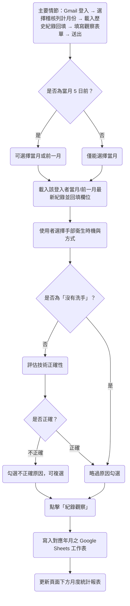
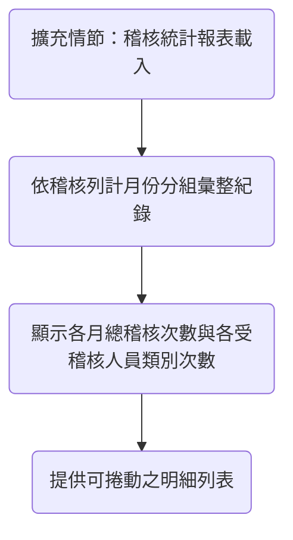

> **使用說明（本說明不屬於論文內容，請於定稿前刪除）**
> 本文件仿照您提供的碩士論文範本（封面、審定書、致謝、摘要、目錄、正文六章、參考文獻）重新彙整「手部衛生稽核系統」專案內容。以下幾類資訊涉及您個人身分、指導教授、學校與委員簽名等，**我無法也不會替您杜撰**，全部以「〔請填入…〕」標示，請您本人確認並填寫／經校方與委員完成正式程序：
> 1. 封面之學校全名、系所名稱、指導教授姓名、您的姓名、口試通過日期。
> 2. 「碩士學位考試委員會審定書」——此頁必須在您完成真實口試、由指導教授與委員親自簽名後才能成立，本文件僅提供空白格式，切勿代填任何姓名或簽名。
> 3. 「致謝」——涉及您個人真實的師長、家人、同儕，請自行撰寫。
> 4. 目錄／圖目錄／表目錄的頁碼，建議您在 Word 中使用「參考資料 → 目錄」與「插入圖表標號」功能，待全文排版定稿後自動產生，本文件不手動填入假頁碼。
> 5. 第 5 章原範本為「專家訪談」，但本專案目前沒有真實的專家訪談資料，因此依您先前確認，改寫為「開發歷程與品質保證分析」，內容全部依據本專案實際的 git 版本控制紀錄與程式碼佐證，未虛構任何受訪者或發言。

---

# 封面

國立〔請填入學校全名〕大學〔請填入學院名稱〕〔請填入系所名稱〕碩士班
The Master Program of 〔College Name〕
〔University Name in English〕

碩士學位論文
Master Thesis

指導教授：〔請填入指導教授姓名〕 博士
Advisor：〔Advisor Name〕 Ph.D.

**手部衛生稽核系統之實務：以 AI 輔助程式開發（Vibe Coding）建置雲端稽核工具的應用與開發歷程分析**
**Vibe Coding in Practice: Building and Evaluating a Cloud-Based Hand Hygiene Audit System through AI-Assisted Development**

研究生：〔請填入姓名〕 撰
Name：〔Name in English〕

中華民國〔　　〕年〔　　〕月
〔Month〕, 〔Year〕

---

# 碩士學位考試委員會審定書（空白格式，請於正式口試後由校方與委員親自完成）

本校　〔　　　　　　〕學院〔　　　　　　〕碩士班　　　　　〔姓名〕　　　　君

所提論文　〔論文名稱〕

經本委員會審查合格並口試通過，特此證明。

學位考試委員會

委　員：＿＿＿＿＿＿＿＿＿＿＿

　　　　＿＿＿＿＿＿＿＿＿＿＿

　　　　＿＿＿＿＿＿＿＿＿＿＿

指導教授：＿＿＿＿＿＿＿＿＿＿＿

院　　長：＿＿＿＿＿＿＿＿＿＿＿

中　華　民　國　　　　年　　　　月　　　　日

---

# 致謝

〔請自行撰寫。此處應感謝您真實的指導教授、家人、協助您完成手部衛生稽核系統開發與稽核業務的同事夥伴等，內容請由您本人撰寫，不宜由他人代筆。〕

---

# 摘要

手部衛生遵從率是感染管制品質核心指標，WHO 五大時機為現行主流稽核架構[1][2]，但第一線多仍仰賴紙本表單與事後人工彙整，難以即時彙總且耗費人力。本研究開發一套結合 Streamlit 前端與 Google Sheets 雲端後端的手部衛生稽核系統，支援 Gmail 登入、WHO 五大時機結構化表單、依乾濕洗手動態顯示不正確原因、自動月份分頁、歷史紀錄回填與月度統計報表。系統由不具軟體工程背景之稽核人員，透過 AI 程式碼生成工具以自然語言迭代開發完成，屬於「Vibe Coding」實務[5][6]。本研究以完整 git 紀錄重建約 6 個月、49 次提交之開發歷程，發現開發速度雖快，卻反覆出現時區錯誤、欄位命名不一致等「先求能動、後補品質」現象，印證速度—品質權衡矛盾[5]；未採自動化測試，但以模擬資料與正式資料分流、版本控制回復機制作為安全網，使非專業開發者仍能建立相對穩定之品質保證實務。最後就身分驗證機制與資料庫擴充性等限制，提出未來系統改善方向與建議。

**關鍵字：** 手部衛生稽核、WHO 五大時機、雲端資料收集、Streamlit、Vibe Coding、AI 輔助程式開發

---

# Abstract

Hand hygiene compliance is a core indicator of infection-control quality, and the WHO's "Five Moments for Hand Hygiene" is the most widely adopted direct-observation framework for auditing it [1][2]. In most hospitals and long-term-care institutions, however, front-line auditing still relies on paper checklists followed by manual data entry, creating practical pain points such as difficulty aggregating records from multiple auditors and the heavy manual effort required for cross-department, cross-month statistics.

This study presents a cloud-based hand hygiene audit system built on a **Streamlit** front end and a **Google Sheets** back end (accessed through a `gspread` service account). The system supports lightweight Gmail-based login, a structured WHO Five-Moments form, a checklist of incorrect-technique reasons that adapts to whether hand hygiene was performed with alcohol-based hand rub or soap and water, automatic monthly worksheet partitioning keyed on a user-declared "audit month," auto-filled history for returning auditors, and month-grouped compliance statistics. Unlike systems built by outsourced vendors or dedicated engineering teams, this system was built independently by an auditing-domain practitioner without a full-time software-engineering background, through iterative natural-language prompting of an AI code-generation tool — a development mode closely matching recent accounts of "vibe coding" in the literature [5][6].

Using the complete git version-control history as evidence, this study reconstructs and analyzes roughly six months and 49 commits of development — replacing the original template's "expert interview" chapter with a "Development Process and Quality-Assurance Analysis" chapter. The results show development was extremely fast, often producing double-digit feature iterations within a single day, but also exhibited timezone bugs, undefined variables, inconsistent column naming, and even full-file rollbacks, echoing the "speed–quality trade-off paradox" identified by Fawzy et al. [5]. At the same time, the case shows that separating mock test data from production data, together with the traceable safety net of fine-grained git commits, allowed a non-professional developer to build a tool for regulatory-compliance and quality-auditing purposes that has remained usable in the long run. The study concludes with concrete recommendations for practitioners building audit/quality tools via vibe coding in healthcare settings, and identifies authentication and database-scalability limitations of the current architecture as directions for future work.

**Keywords:** Hand Hygiene Audit, WHO Five Moments, Cloud Data Collection, Streamlit, Vibe Coding, AI-Assisted Programming

---

# 目錄

（請於 Word 中使用「參考資料 → 目錄 → 自動目錄」功能，依標題樣式自動產生頁碼，以下僅列出章節架構供對照）

致謝
摘要
Abstract
目錄
圖目錄
表目錄
1. 緒論
2. 文獻探討
&nbsp;&nbsp;2.1 手部衛生稽核之應用與挑戰
&nbsp;&nbsp;2.2 手部衛生稽核系統應用雲端試算表之風險探討
&nbsp;&nbsp;2.3 AI 輔助程式開發（Vibe Coding）與應用程式整合情況
3. 研究方法
&nbsp;&nbsp;3.1 需求分析
&nbsp;&nbsp;3.2 研究架構
&nbsp;&nbsp;3.3 功能介紹
4. 系統流程與使用情境
&nbsp;&nbsp;4.1 系統使用流程
&nbsp;&nbsp;4.2 使用情境討論
5. 開發歷程與品質保證分析
&nbsp;&nbsp;5.1 開發歷程總覽
&nbsp;&nbsp;5.2 速度與品質之權衡
&nbsp;&nbsp;5.3 品質保證實務分析
&nbsp;&nbsp;5.4 研究結果
6. 結論與討論
&nbsp;&nbsp;6.1 研究結論
&nbsp;&nbsp;6.2 研究限制
&nbsp;&nbsp;6.3 未來發展
&nbsp;&nbsp;6.4 技術整合的問題與困難
參考文獻
附件 系統流程設計語法（以 Mermaid 標記呈現）

# 圖目錄

圖 1　系統架構圖
圖 2　系統使用流程圖

# 表目錄

表（一）　系統核心功能與對應設計決策
表（二）　開發階段與提交分布
表（三）　提交內容性質分布
表（四）　Vibe Coding 文獻主要主題摘要

---

# 1. 緒論

手部衛生（hand hygiene）是預防醫療照護相關感染最具成本效益的介入措施之一。世界衛生組織（WHO）提出的「手部衛生五大時機」——接觸病人前、執行清潔／無菌操作技術前、暴露病人體液風險後、接觸病人後、接觸病人周遭環境後——已成為全球醫療機構稽核手部衛生遵從率的共通架構[1][2]。直接觀察法（direct observation）長期被視為此類稽核的「金標準」，但實務執行上，多數院所與長照機構的第一線稽核作業仍以紙本表單搭配事後人工登打的方式進行：稽核人員在病房內以紙筆逐項勾選觀察結果，稽核月底再由專責人員彙整成 Excel 報表。這種流程存在幾個實務痛點：（1）多位稽核人員的紀錄難以即時彙總；（2）跨科別、跨月份的統計需要大量人工整理；（3）紙本表單遺失或字跡辨識問題會直接影響資料品質；（4）稽核人員若分散於不同院區或班別，紙本傳遞造成延遲。

近年來，AI 程式碼生成工具（如 GitHub Copilot、ChatGPT、Claude 等）的普及，讓不具備專業軟體工程背景的使用者，也能以自然語言描述需求、迭代生成可執行的應用程式。這種依賴直覺與反覆嘗試、而非深入理解底層程式碼的開發方式，近期被稱為「Vibe Coding」[6]。Fawzy 等人[5]針對 101 份實務灰色文獻進行系統性回顧後指出，vibe coding 使用者普遍以「速度」與「可及性」為主要動機，並經常體驗到「立即成功的心流」，但同時也承認產出的程式碼「快但有缺陷」，且品質保證（QA）作業經常被省略、被過度信任，或整個委由 AI 自行檢查。

本研究報告的手部衛生稽核系統，正是在真實醫療／長照場域中，由稽核業務相關人員以 AI 輔助、vibe coding 式的迭代提示方式獨立完成的一個實例。本研究的目的有三：

1. 描述一套實際運作中的雲端手部衛生稽核系統之需求、架構與關鍵設計決策（第 3、4 章）；
2. 以完整的 git 版本控制紀錄為依據，重建並分析該系統約 6 個月的 AI 輔助開發歷程，作為 vibe coding 在醫療品質稽核領域的第一手縱向案例（第 5 章）；
3. 對照既有 vibe coding 文獻的發現，討論在「稽核資料攸關法規遵循與病人安全」此一高風險情境下，非專業開發者以 AI 輔助建置工具時，應如何取捨速度與品質、應採取哪些具體的品質保證作法，並指出現行系統架構的限制與未來發展方向（第 6 章）。

# 2. 文獻探討

## 2.1 手部衛生稽核之應用與挑戰

WHO 於 2009 年發布之《WHO Guidelines on Hand Hygiene in Health Care》為手部衛生稽核建立了全球共通的規範基礎[2]，其中 Sax 等人[1]提出的「My Five Moments for Hand Hygiene」概念，將手部衛生時機以使用者中心（user-centred）的設計方式，簡化為醫護人員易於記憶與現場判斷的五個時機，該架構至今仍是本研究系統表單設計的核心依據。

然而，直接觀察法本身存在觀察者效應（Hawthorne effect）的限制：Wu 等人[3]針對某教學醫院進行為期 15 個月的世代研究，比較「明顯稽核」（overt observation）與「隱蔽稽核」（covert observation）的遵從率差異，發現明顯稽核之遵從率（78%）顯著高於隱蔽稽核（55%），且此效應在護理人員與門診場域中更為明顯，顯示直接觀察所得的遵從率數字可能被稽核當下的「被觀察意識」高估，未必能反映真實的日常遵從情形。為降低此類偏誤與人力負擔，部分院所導入電子式監測系統，如感應式警示裝置、影像輔助觀察等；Wang 等人[4]針對電子式手部衛生監測技術進行系統性回顧，分析 73 篇相關研究，發現此類系統雖能提升監測的客觀性與即時性，但同時面臨準確度、資料整合、隱私與建置成本等挑戰，其導入複雜度往往超出中小型院所或長照機構的能力範圍。

本研究所述系統採取的策略，是保留直接觀察法的專業判斷（由受過訓練的稽核人員現場評估時機與技術正確性），但以低成本的雲端表單取代紙本紀錄與人工彙整，藉此在不改變既有稽核方法學的前提下，解決資料蒐集與彙整的效率問題，也不涉及電子監測系統所面臨的感測器建置與資料整合挑戰。

## 2.2 手部衛生稽核系統應用雲端試算表之風險探討

以 Google Sheets 這類通用試算表工具作為正式系統的資料庫，是本研究系統得以低成本、快速上線的關鍵設計，但此作法本身亦有其風險，值得於文獻脈絡中先行檢視。Panko[8]長期研究終端使用者運算（end-user computing）中的試算表錯誤問題，指出即便是有經驗的試算表開發者，其產出的試算表模型中仍普遍存在難以察覺的欄位與公式錯誤，錯誤的來源多半並非來自對試算表軟體操作的生疏，而是來自對邏輯規劃的疏漏。這項發現對於本研究具有直接的參考意義：手部衛生稽核資料一旦涉及月份歸屬、遵從率計算等邏輯，若欄位命名或分頁邏輯不一致，即便系統本身「能夠執行」，仍可能產生統計上的錯誤。

此外，由不具正式軟體工程訓練的使用者建置正式系統，在資訊系統文獻中亦有相對應的討論脈絡——「公民開發者」（citizen developer）與低程式碼（low-code）平台的治理議題。Viljoen 等人[7]的研究指出，讓不具備正式軟體工程背景的使用者利用低程式碼平台快速開發應用程式，雖能提升組織效率，卻也可能因缺乏治理而產生軟體品質不佳、陰影 IT（shadow IT）與技術債等風險，在醫療等高度受規範產業中尤其需要謹慎。雖然本研究系統的開發方式（vibe coding）與低程式碼平台在技術路徑上不同——前者以自然語言驅動 AI 生成程式碼，後者以視覺化拖拉元件為主——但兩者共享同一核心風險：開發速度與可及性的提升，往往伴隨對底層邏輯理解程度的下降，這也是本研究第 5 章所欲深入檢視的核心議題。

## 2.3 AI 輔助程式開發（Vibe Coding）與應用程式整合情況

Karpathy[6]於 2025 年提出「vibe coding」一詞，描述使用者以自然語言描述期望結果、透過 AI 程式碼生成工具反覆提示，而非深入理解生成程式碼的開發方式。Fawzy 等人[5]對 101 份實務灰色文獻進行系統性回顧，萃取 518 個行為單元，並依動機（RQ1）、體驗（RQ2）、程式碼品質認知（RQ3）與品質保證作法（RQ4）四個構面進行主題分析，其主要發現摘要如表（四）所示。

**表（四）　Vibe Coding 文獻主要主題摘要（改編自 Fawzy 等人[5]）**

| 構面 | 最主要主題 | 佔比 |
|---|---|---|
| 動機（RQ1） | 速度與效率 | 62% |
| 體驗（RQ2） | 立即成功的心流 | 64% |
| 程式碼品質認知（RQ3） | 快但有缺陷 | 68% |
| 品質保證作法（RQ4） | 略過 QA | 36% |

該研究同時指出，vibe coding 正在造就一群「能建置產品、卻無法在出錯時自行除錯」的新型脆弱開發者，而現有 vibe coding 研究多以橫斷面、第三方彙整他人自述的方式取樣，較少針對單一、攸關法規遵循的正式系統，追蹤其完整版本歷程。本研究即嘗試補上這一塊：以真實的 git 提交紀錄作為行為證據，而非受訪者的事後回憶或部落格自述，檢視 vibe coding 文獻歸納的主題在一個具體、長期運作系統中的呈現方式，相關分析詳見第 5 章。

# 3. 研究方法

## 3.1 需求分析

本研究旨在開發一套結合 AI 程式碼生成工具、用以取代紙本手部衛生稽核流程的雲端系統。系統的核心需求包括：

- **多人同時填寫**：不同班別、不同單位的稽核人員可在各自的裝置上同時填寫，不需共用同一份檔案；
- **免自建伺服器與資料庫**：以最低的建置與維運成本，達成資料的雲端集中儲存，適合不具 IT 部門支援的中小型院所或長照機構；
- **結構化的 WHO 五大時機紀錄**：避免紙本自由填寫造成的欄位不一致，確保後續統計的一致性；
- **依乾洗手／濕洗手動態呈現不正確原因**：因兩種手部衛生方式的常見錯誤型態不同（如乾洗手著重搓揉時間，濕洗手著重是否擦乾），需分開設計選項；
- **月度統計與明細報表**：提供稽核人員與感控單位隨時查看當月／前一月的稽核次數、人員類別分布與明細列表；
- **開發與維運成本考量**：由於開發者不具全職軟體工程背景，系統選型須以「可透過自然語言與 AI 程式碼生成工具溝通、快速獲得可執行結果」為前提，這也直接影響了第 3.2 節的架構選擇。

## 3.2 研究架構

系統採取三層式架構：Streamlit 提供瀏覽器端的表單介面與狀態管理（`st.session_state`）[9]；`gspread` 服務帳號作為後端資料存取層[10]；Google Sheets 則作為零維運成本的多人共享資料庫[11]，並以「年＋月」（例如「2026年7月」）作為工作表（worksheet）的分頁單位。此架構之選擇本身即是 AI 輔助開發的產物——如第 5 章所述，開發者並未主動比較資料庫方案，而是由 AI 程式碼生成工具依需求描述直接建議並實作此組合。

〔圖 1：系統架構圖，請參見附圖〕

**表（一）　系統核心功能與對應設計決策**

| 功能模組 | 說明 |
|---|---|
| Gmail 登入 | 以文字輸入 Email 作為輕量級的使用者識別，用於歷史紀錄回填與資料歸戶（非正式 OAuth 驗證，見第 6.4 節限制討論） |
| WHO 五大時機表單 | 單選五大時機、單選手部衛生方式（乾洗手／濕洗手／沒有洗手） |
| 動態不正確原因複選 | 依乾洗手或濕洗手顯示不同的不正確原因選項，並支援複選與「其他」自由輸入 |
| 稽核列計月份邏輯 | 每月 5 日前可檢視前一個月的稽核結果，6 日起僅顯示當月，避免月份混淆 |
| 依月份自動分頁 | 依「稽核列計月份」而非系統送出時間寫入對應年月工作表，確保紀錄歸入正確月份 |
| 歷史紀錄回填 | 載入登入者當月（含寬限期內前一月）最新一筆紀錄，自動帶入單位、姓名、人員類別等重複性欄位 |
| 快取與配額管理 | 以 `st.cache_data`（TTL 120 秒）搭配 `cache_buster` 版本號，降低對 Google Sheets API 的重複查詢頻率 |
| 月度統計報表 | 依「稽核列計月份」分組，顯示各月總稽核次數、各受稽核人員類別次數，並提供可捲動的明細表格 |

## 3.3 功能介紹

### 3.3.1 稽核表單填寫功能介紹

使用者以 Gmail 帳號登入後，系統會依目前日期決定可選擇的「稽核列計月份」：每月 5 日前可選擇當月或前一個月，6 日起僅能選擇當月。表單左側卡片為「稽核基本資料」，包含隸屬稽核單位／病房（如 ER、ICU、內科、松齡病區、康寧居、日照等，涵蓋急性病房與長照單位）、稽核人員姓名、受稽核人員類別（護理師、照服員、外籍照服員等）；右側卡片為「手部衛生行為觀察」，包含 WHO 五大時機單選、手部衛生方式單選（乾洗手／濕洗手／沒有洗手），以及依所選方式動態呈現的「正確性評估」與「不正確原因」複選清單。此設計讓單一工作表即可同時支撐「遵從率計算」與「不正確原因的類型分析」兩種後續分析需求。

### 3.3.2 歷史紀錄與統計報表功能介紹

系統會在使用者選定稽核列計月份後，自動載入該登入者當月（於寬限期內含前一月）最新一筆紀錄，並將單位、姓名、人員類別等重複性欄位自動回填至表單，減少重複輸入。頁面下方另提供「稽核統計報表」，依稽核列計月份分組，顯示各月總稽核次數、各受稽核人員類別次數，並提供可捲動的明細列表，供稽核人員與感控單位隨時查閱。

# 4. 系統流程與使用情境

## 4.1 系統使用流程

〔圖 2：系統使用流程圖，請參見附圖〕

系統的基本使用流程如下：使用者於瀏覽器開啟系統網址後，以 Gmail 帳號登入；系統依當日日期決定可選擇之稽核列計月份，並嘗試載入該登入者當月的歷史紀錄以回填常用欄位；使用者確認或修改單位、人員類別等欄位後，依序選擇手部衛生時機、手部衛生方式，若非「沒有洗手」則進一步評估技術正確性，如評估為不正確則勾選對應原因；使用者點擊「紀錄觀察」後，系統將該筆紀錄寫入對應年月之 Google Sheets 工作表，並更新頁面下方的統計報表。

〔請於此處插入系統實際操作畫面截圖，以符合原範本圖 6～圖 12 之呈現方式〕

## 4.2 使用情境討論

為說明系統於實務場域的應用價值，以下依本系統實際涵蓋的稽核單位與人員類別（詳見 3.3 節），列舉三個貼近真實運作的使用情境：

### 4.2.1 情境一：日班稽核人員即時記錄手部衛生觀察

稽核人員於病房內以行動裝置開啟系統，逐筆記錄觀察到的手部衛生時機與執行方式；系統之表單設計避免了紙本自由填寫可能造成的欄位缺漏，且送出後立即同步至雲端，不需等待班別結束後再行彙整。

### 4.2.2 情境二：跨單位、跨班別稽核資料即時彙整

不同單位（如 ICU、內科病房、長照病區）之稽核人員可各自於不同時間、不同裝置上填寫，資料依「年＋月」自動分頁彙整於同一份 Google Sheets，感控人員無須再手動合併多份紙本或 Excel 檔案。

### 4.2.3 情境三：感染管制人員月度遵從率報表審閱

每月月初，感染管制相關人員可透過系統下方之「稽核統計報表」，直接檢視前一月與當月之總稽核次數、各受稽核人員類別分布，作為月度品質報告與後續教育訓練規劃之依據，取代人工彙整報表的作業流程。

# 5. 開發歷程與品質保證分析

> 本章取代原範本之「專家訪談」章節。由於本專案目前並無真實的專家訪談資料，依前述確認，本章改以本專案實際的 git 版本控制紀錄與程式碼作為第一手證據，分析系統之開發歷程與品質保證實務，不涉及任何虛構之受訪者或發言內容。

## 5.1 開發歷程總覽

本研究以 `git log` 完整重建開發時間軸。系統自 2026 年 1 月 10 日首次提交至 2026 年 7 月 2 日最新一批提交，共計 **49 次提交**，可分為五個階段，如表（二）所示。

**表（二）　開發階段與提交分布（依日期彙總，共 49 次提交）**

| 階段 | 日期 | 提交數 | 主要內容 |
|---|---|---|---|
| 第一階段：初版建置 | 2026-01-10 | 8 | 建立 Streamlit 表單雛型、串接 Google Sheets、修正「沒有洗手」選擇邏輯、依乾洗手／濕洗手區分不正確原因、依月份自動分頁 |
| 第二階段：欄位微調 | 2026-01-11～01-13 | 4 | 更正單位名稱錯字、不正確原因改為複選核取方塊、調整選項文字用詞 |
| 第三階段：規則修正 | 2026-02-26 | 4 | 新增「感管中心」單位選項、修正稽核列計月份選擇邏輯、修正 `audit_month` 未定義錯誤、修正時區問題 |
| 第四階段：歷史紀錄功能 | 2026-04-02 | 11 | 新增月度歷史紀錄回填功能、修正欄位命名、依稽核列計月份而非送出時間歸戶、重構月度統計報表 |
| 第五階段：顯示規則與 UI／效能重構 | 2026-04-09、2026-07-02 | 22 | 調整同使用者月度顯示規則、大量降低 Google Sheets API 呼叫、含 2 次「回復到前一版本」的還原提交、8 次版面配置調整 |

我們進一步將 49 次提交的訊息依內容性質概分為四類，如表（三）所示。

**表（三）　提交內容性質分布（n=49）**

| 類別 | 次數 | 佔比 | 範例 |
|---|---|---|---|
| 功能新增 | 15 | 31% | 新增受稽核人員類別、新增歷史紀錄回填、新增月度統計報表 |
| 錯誤修正 | 20 | 41% | 修正時區問題、修正 `audit_month` 未定義錯誤、修正報表顯示月份過濾 |
| 介面／體驗優化 | 10 | 20% | 版面重排、核取方塊間距、字級調整 |
| 版本回復 | 2 | 4% | 回復 `app_new.py` 至前一穩定提交 |
| 效能優化 | 2 | 4% | 降低 Google Sheets 讀取次數、合併 API 呼叫 |

值得特別說明的是第五階段中出現的兩筆提交：「Restore app_new.py to commit 1a50add (show history version)」與「Restore previous app_new version」。這兩筆提交顯示，在快速迭代嘗試新版面／新架構的過程中，曾出現方向錯誤、必須整支檔案回復到先前穩定版本的情況——這與 Fawzy 等人[5]描述的「Code Breakdown or Abandonment」經驗高度相似，差別在於此處並未真正放棄專案，而是憑藉 git 版本控制，將「重新提示、越改越糟」的風險，收斂為「回復到已知可用版本、重新規劃後再出發」。

## 5.2 速度與品質之權衡

Fawzy 等人[5]指出，vibe coder 普遍以速度為最主要動機（62%），卻也最常認為產出程式碼「快但有缺陷」（68%）。本案例完整重現了這個矛盾：初版系統在一天之內（2026-01-10）即完成可用的表單雛型並成功串接雲端試算表，讓稽核人員得以立即開始使用；但同一套系統其後又陸續在近半年間，因時區判斷錯誤、月份歸屬邏輯錯置、變數未定義、API 配額超限等問題而多次「上線後修正」。與純粹的個人專案或展示型 demo 不同的是，這套系統從第一天起便被實際用於蒐集攸關感染管制品質的正式稽核資料，代表每一次「先求能動、事後修正」的空窗期，都可能對應到一段時間內實際流入生產資料表、卻帶有已知錯誤的稽核紀錄。此觀察也呼應 Panko[8]對試算表錯誤的研究：本案例中欄位命名不一致（「稽核月份」vs.「稽核列計月份」）所導致的統計歸屬問題，正是「試算表即資料庫」風險的具體展現。

## 5.3 品質保證實務分析

檢視整個 git 歷史與專案檔案，本系統並未採用自動化單元測試，QA 方式基本上屬於「實際執行、以能否跑通作為正確性替代指標」與「人工操作驗證」的混合：開發者透過瀏覽器實際操作表單、送出資料後至 Google Sheets 檢視結果是否符合預期，藉此驗證每次修改。更值得肯定的是，專案中保留了 `generate_mock_data.py`（產生模擬稽核資料）與 `clear_test_data.py`（清除測試資料）等輔助腳本，顯示開發者有意識地將測試資料與正式資料分流：先以模擬資料驗證表單邏輯與報表統計是否正確，再清除測試資料、避免污染正式稽核紀錄。這是一項在 vibe coding 文獻中較少被強調、但對「攸關法規遵循用途的工具」格外關鍵的實務。

此外，第 5.1 節提及的兩次「回復到前一版本」提交，具體示範了 git 版本控制如何緩解 vibe coding 常見的「重新提示、越改越糟」風險：當某次重構偏離預期時，開發者選擇直接回復到已知可用的提交，而非在錯誤的基礎上繼續要求 AI「修一下這裡、修一下那裡」。這顯示：保留細粒度的提交紀錄，讓開發者能隨時回到「上一個能動的版本」，是非專業開發者以 AI 輔助建置正式系統時，相對容易導入、卻能有效降低風險的紀律，即便開發者本身不深入理解每一行程式碼的實作細節。

## 5.4 研究結果

綜合表（二）、表（三）的分析，本研究對開發歷程的檢視結果可歸納為三點：（1）49 次提交高度集中於 3 個「衝刺日」（2026-01-10、2026-04-02、2026-07-02），三日合計佔全部提交數的 77.6%（38/49），顯示 vibe coding 傾向以「一次性推進到某個穩定里程碑」而非細水長流的方式進行；（2）錯誤修正（41%）與功能新增（31%）合計逾七成，其中錯誤修正又以「欄位命名／資料歸屬邏輯不一致」與「效能／配額問題」最為集中，兩者皆屬於「上線後才發現」的問題；（3）測試資料與正式資料分流、以及版本控制的回復機制，是本案例中能將 AI 輔助開發風險控制在可接受範圍的兩項關鍵實務，值得作為同類場景的參考作法。

# 6. 結論與討論

## 6.1 研究結論

本研究以一套實際運作中的雲端手部衛生稽核系統為案例，說明非專業軟體開發者如何透過 AI 輔助的 vibe coding 方式，在約 6 個月、49 次提交的迭代中，將紙本稽核流程轉換為具備多人協作、月度自動分頁、歷史回填與統計報表功能的正式工具。透過完整的版本歷程回顧，本研究驗證了 Fawzy 等人[5]提出的「速度—品質權衡矛盾」在真實的醫療品質稽核場景中同樣成立：系統能在一天之內產出可用雛型，卻也在其後數月間持續因時區、月份歸屬、API 配額等問題反覆修正。與此同時，本案例也顯示，測試資料與正式資料分流、以及以版本控制作為錯誤回復的安全網，是非專業開發者在缺乏正式軟體工程訓練的情況下，仍能將 AI 輔助開發的風險控制在可接受範圍、產出可長期穩定運作系統的關鍵實務。

## 6.2 研究限制

本研究屬於單一系統、單一開發者的個案分析，觀察結果來自 git 提交訊息與程式碼比對，並未包含開發過程中實際與 AI 互動的完整提示紀錄（prompt log），因此部分「為何如此修正」的判斷仍屬事後推論，而非開發當下的第一手訪談紀錄。此外，本案例的系統規模與使用人數有限，其呈現的開發模式與風險特徵，未必能推論至規模更大、團隊更多元的 vibe coding 專案。

## 6.3 未來發展

未來系統發展可朝以下方向精進：（1）導入正式的 Google OAuth 驗證取代目前僅以文字輸入 Email 的輕量登入方式；（2）評估在使用規模擴大後，是否需將資料庫由 Google Sheets 遷移至更具擴充性的正式資料庫；（3）建立輕量級的自動化測試（如針對月份判定、遵從率計算邏輯的單元測試），降低「上線後才發現」錯誤的比例；（4）延續本研究以 git 紀錄分析開發歷程之方法，未來可進一步比對不同規模、不同風險等級之 AI 輔助開發專案，是否呈現一致的品質保證取捨模式。

## 6.4 技術整合的問題與困難

本系統以 Email 文字輸入作為登入機制，並未串接正式的 Google OAuth 驗證，任何人皆可輸入他人的 Email 以該身份寫入或檢視歷史紀錄，此為現行架構在身分驗證上的明確限制。其次，Google Sheets 作為資料庫在並發寫入與資料量成長後，其 API 配額與查詢效能將逐漸成為系統瓶頸，本案例已在提交紀錄中出現至少 3 次因配額問題導致的修正。第三，系統並未採用自動化測試，邏輯變更的驗證高度仰賴開發者手動操作與模擬資料測試，長期而言，隨著功能複雜度提升，此作法的可靠性可能下降。上述問題顯示，未來若持續以 vibe coding 方式擴充本系統，應同步考慮身分驗證機制、資料庫擴充性與自動化測試三個面向，才能在維持開發速度優勢的同時，降低攸關法規遵循用途系統的品質風險。

# 參考文獻

[1] H. Sax, B. Allegranzi, I. Uçkay, E. Larson, J. Boyce, and D. Pittet, "'My five moments for hand hygiene': a user-centred design approach to understand, train, monitor and report hand hygiene," *Journal of Hospital Infection*, vol. 67, no. 1, pp. 9–21, 2007, doi: 10.1016/j.jhin.2007.06.004.

[2] World Health Organization, *WHO Guidelines on Hand Hygiene in Health Care*. Geneva: World Health Organization, 2009.

[3] K.-S. Wu, S. S.-J. Lee, J.-K. Chen, Y.-S. Chen, H.-C. Tsai, Y.-J. Chen, Y.-H. Huang, and H.-S. Lin, "Identifying heterogeneity in the Hawthorne effect on hand hygiene observation: a cohort study of overtly and covertly observed results," *BMC Infectious Diseases*, vol. 18, p. 369, 2018, doi: 10.1186/s12879-018-3292-5.

[4] C. Wang, W. Jiang, K. Yang, D. Yu, J. Newn, Z. Sarsenbayeva, J. Goncalves, and V. Kostakos, "Electronic Monitoring Systems for Hand Hygiene: Systematic Review of Technology," *Journal of Medical Internet Research*, vol. 23, no. 11, p. e27880, 2021, doi: 10.2196/27880.

[5] A. Fawzy, A. Tahir, and K. Blincoe, "Vibe Coding in Practice: Motivations, Challenges, and a Future Outlook – a Grey Literature Review," arXiv:2510.00328 [cs.SE], 2025.

[6] A. Karpathy, "There's a new kind of coding I call 'vibe coding'," 2025. [Online]. Available: https://x.com/karpathy/status/1886192184808149383

[7] A. Viljoen, M. Radić, et al., "Governing Citizen Development to Address Low-Code Platform Challenges," *MIS Quarterly Executive*, vol. 23, no. 3, Art. 6, 2024.

[8] R. R. Panko, "What We Know About Spreadsheet Errors," *Journal of End User Computing*, vol. 10, no. 2, pp. 15–21, 1998.

[9] Streamlit Inc., "Streamlit Documentation." [Online]. Available: https://docs.streamlit.io/

[10] gspread contributors, "gspread Documentation." [Online]. Available: https://docs.gspread.org/

[11] Google, "Google Sheets API Documentation." [Online]. Available: https://developers.google.com/sheets/api

# 附件　系統流程設計語法（以 Mermaid 標記呈現）

本附件收錄本系統之核心流程設計，採用 Mermaid 標記語言撰寫，供未來系統維護、擴充或視覺化流程圖設計之參考依據。

